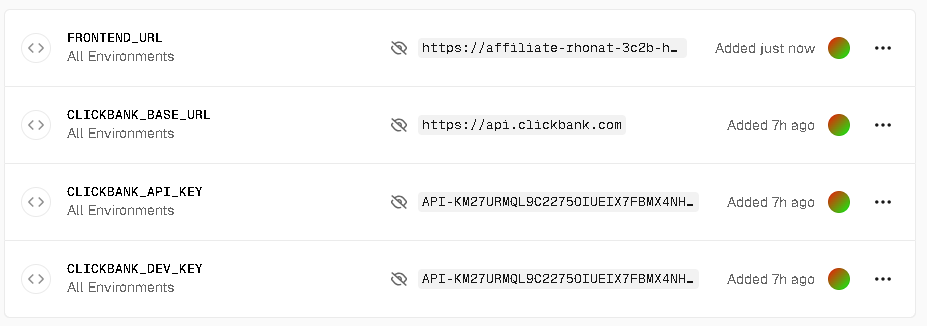
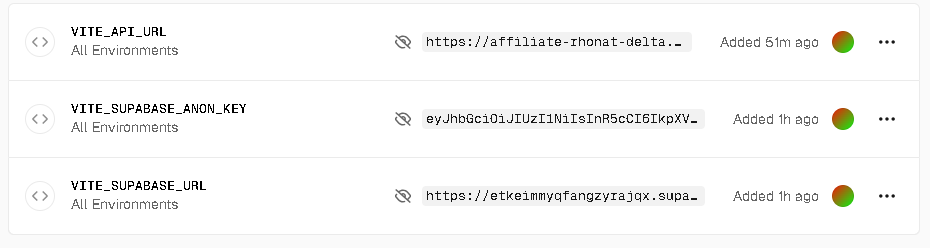

# 🔧 Configuration des Credentials ClickBank

## ❌ Problème Actuel

Vous recevez une erreur 404 de ClickBank car les credentials API ne sont pas configurés sur Vercel.

```
Error: ClickBank API Error (404): {"error":{"code":"404","message":"The page could not be found"}}
```

**Cause**: Les variables d'environnement `CLICKBANK_DEV_KEY` et `CLICKBANK_API_KEY` ne sont pas définies sur Vercel.

## ✅ Solution

### Option 1: Script Automatique (Recommandé)

Utilisez le script PowerShell fourni:

```powershell
.\setup-clickbank-env.ps1
```

Ce script va:
1. Vérifier que Vercel CLI est installé
2. Vous demander vos credentials ClickBank
3. Les configurer sur Vercel
4. Redéployer automatiquement
5. Tester la connexion

### Option 2: Configuration Manuelle via Dashboard

1. **Allez sur Vercel Dashboard**
   - URL: https://vercel.com/dashboard
   - Sélectionnez le projet `affiliate-rhonat-delta`




2. **Accédez aux Variables d'Environnement**
   - Settings → Environment Variables

3. **Ajoutez les variables suivantes:**

   | Variable | Valeur | Où la trouver |
   |----------|--------|---------------|
   | `CLICKBANK_DEV_KEY` | Votre clé développeur | ClickBank → Settings → API Keys |
   | `CLICKBANK_API_KEY` | Votre clé API | ClickBank → Settings → API Keys |
   | `CLICKBANK_BASE_URL` | `https://api.clickbank.com` | (ou `https://api.sandbox.clickbank.com` pour tests) |

4. **Sélectionnez les environnements**
   - ✅ Production
   - ✅ Preview
   - ✅ Development

5. **Redéployez**
   - Vercel redéploiera automatiquement après l'ajout des variables
   - Ou manuellement: `cd backend-serverless && vercel --prod`

### Option 3: Via Vercel CLI

```powershell
# Se connecter à Vercel
vercel login

# Aller dans le dossier backend
cd backend-serverless

# Ajouter les variables
vercel env add CLICKBANK_DEV_KEY production
# Entrez votre clé quand demandé

vercel env add CLICKBANK_API_KEY production
# Entrez votre clé quand demandé

vercel env add CLICKBANK_BASE_URL production
# Entrez: https://api.clickbank.com

# Redéployer
vercel --prod
```

## 🧪 Vérification

Une fois configuré, testez l'endpoint de santé:

```powershell
# PowerShell
Invoke-RestMethod -Uri "https://affiliate-rhonat-delta.vercel.app/api/clickbank/health"
```

Ou dans votre navigateur:
```
https://affiliate-rhonat-delta.vercel.app/api/clickbank/health
```

### Réponses Attendues

**✅ Succès (credentials corrects):**
```json
{
  "status": "ok",
  "message": "ClickBank API is reachable"
}
```

**❌ Credentials manquants:**
```json
{
  "status": "error",
  "message": "ClickBank credentials (CLICKBANK_DEV_KEY and CLICKBANK_API_KEY) are not configured..."
}
```

**❌ Credentials invalides:**
```json
{
  "status": "error",
  "message": "Cannot reach ClickBank API"
}
```

## 🔐 Où Trouver vos Credentials ClickBank

1. **Connectez-vous à ClickBank**
   - URL: https://accounts.clickbank.com/

2. **Accédez aux API Keys**
   - Settings → API Keys
   - Ou directement: https://accounts.clickbank.com/account/api-keys

3. **Créez ou Récupérez vos clés**
   - **Developer API Key** (CLICKBANK_DEV_KEY)
   - **Clerk API Key** (CLICKBANK_API_KEY)

4. **Environnement**
   - **Production**: Utilisez vos vraies clés + `https://api.clickbank.com`
   - **Sandbox/Test**: Utilisez vos clés de test + `https://api.sandbox.clickbank.com`

## 🚨 Sécurité

⚠️ **IMPORTANT:**
- ❌ Ne commitez JAMAIS vos clés dans Git
- ✅ Utilisez toujours les variables d'environnement
- ✅ Les clés sont sensibles et donnent accès à votre compte
- ✅ Utilisez l'environnement sandbox pour les tests
- ✅ Régénérez vos clés si elles sont compromises

## 📝 Après Configuration

Une fois les credentials configurés:

1. ✅ Le backend pourra communiquer avec ClickBank
2. ✅ Les erreurs 404 disparaîtront
3. ✅ Vous pourrez récupérer vos commandes et analytics
4. ✅ Le frontend affichera les données correctement

## 🆘 Dépannage

### Problème: "Cannot reach ClickBank API"
- Vérifiez que vos credentials sont corrects
- Vérifiez que vous utilisez le bon `CLICKBANK_BASE_URL`
- Testez vos credentials directement sur ClickBank

### Problème: "Credentials not configured"
- Vérifiez que les variables sont bien ajoutées sur Vercel
- Vérifiez que vous avez redéployé après l'ajout
- Attendez quelques minutes pour la propagation

### Problème: Toujours des erreurs 404
- Vérifiez les logs Vercel: https://vercel.com/dashboard
- Vérifiez que le déploiement est réussi
- Testez l'endpoint `/api/clickbank/health` directement

## 📚 Ressources

- [Documentation ClickBank API](https://api.clickbank.com/rest/1.3/docs)
- [Vercel Environment Variables](https://vercel.com/docs/concepts/projects/environment-variables)
- [Guide de déploiement](./BACKEND_DEPLOYED.md)
