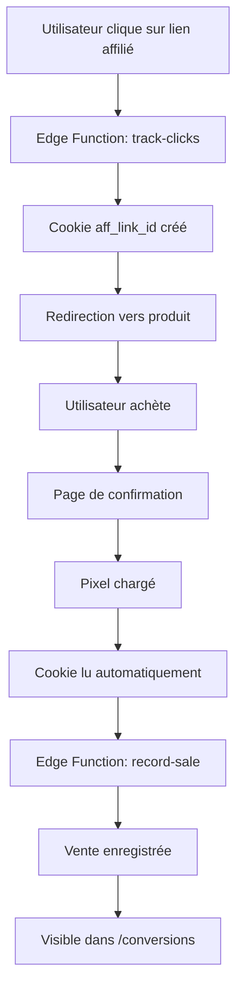

# 🎯 Système de Tracking des Conversions

> **Système complet de suivi des ventes par pixel de conversion**

## 📋 Table des Matières

- [Vue d'ensemble](#-vue-densemble)
- [Accès Rapide](#-accès-rapide)
- [Fonctionnalités](#-fonctionnalités)
- [Utilisation](#-utilisation)
- [Documentation](#-documentation)
- [Support](#-support)

## 🌟 Vue d'ensemble

Le système de tracking des conversions permet de **comptabiliser automatiquement les ventes** réalisées via vos liens d'affiliation en utilisant la **méthode pixel**.

### Comment ça marche ?

1. **Clic** → Cookie créé (30 jours)
2. **Achat** → Page de confirmation
3. **Pixel** → Vente enregistrée automatiquement
4. **Dashboard** → Statistiques en temps réel

## 🚀 Accès Rapide

### Interface Web

```
http://localhost:5173/conversions
```

### Menu Navigation

```
Sidebar → Conversions (icône graphique)
```

## ✨ Fonctionnalités

### 📊 Statistiques en Temps Réel

- **Total Conversions** : Nombre de ventes
- **Revenu Total** : Montant total généré
- **Commission Totale** : Vos gains
- **Taux de Conversion** : % de clics convertis

### 🔧 Générateur de Pixel

- Sélection du lien d'affiliation
- Génération automatique du code
- Copie en un clic
- Instructions détaillées

### 📋 Historique Complet

- Tableau de toutes les ventes
- Informations détaillées :
  - Date et heure
  - Produit vendu
  - Lien utilisé
  - ID de commande
  - Montant et commission

## 💡 Utilisation

### Étape 1 : Générer le Pixel

1. Allez sur `/conversions`
2. Cliquez sur **"Afficher"** dans "Générateur de Pixel"
3. Sélectionnez votre lien d'affiliation
4. Cliquez sur **"Générer le Code Pixel"**
5. Copiez le code généré

### Étape 2 : Intégrer le Pixel

Collez ce code sur votre **page de confirmation** (page "Merci") :

```html
<!-- Pixel de conversion -->
<script>
(function() {
  var orderId = 'ORD-12345';  // ⚠️ Remplacer par l'ID réel
  var amount = 99.90;          // ⚠️ Remplacer par le montant réel
  
  var img = new Image(1, 1);
  img.src = 'https://votre-url.supabase.co/functions/v1/record-sale?order_id=' + orderId + '&amount=' + amount;
  img.style.display = 'none';
  document.body.appendChild(img);
})();
</script>
```

### Étape 3 : Vérifier

1. Testez avec une vraie commande
2. Vérifiez dans `/conversions`
3. La vente doit apparaître dans le tableau

## 📚 Documentation

### Guides Complets

| Document | Description |
|----------|-------------|
| **[GUIDE_CONVERSIONS_PIXEL.md](./GUIDE_CONVERSIONS_PIXEL.md)** | Guide complet avec exemples de code |
| **[CONVERSIONS_IMPLEMENTATION_SUMMARY.md](./CONVERSIONS_IMPLEMENTATION_SUMMARY.md)** | Récapitulatif technique détaillé |
| **[CONVERSIONS_QUICK_REFERENCE.md](./CONVERSIONS_QUICK_REFERENCE.md)** | Référence rapide et points clés |

### Exemples de Code

#### PHP
```php
<script>
(function() {
  var orderId = '<?php echo $order_id; ?>';
  var amount = <?php echo $order_total; ?>;
  
  var img = new Image(1, 1);
  img.src = 'https://votre-url.supabase.co/functions/v1/record-sale?order_id=' + orderId + '&amount=' + amount;
  img.style.display = 'none';
  document.body.appendChild(img);
})();
</script>
```

#### React
```javascript
useEffect(() => {
  const img = new Image(1, 1);
  img.src = `https://votre-url.supabase.co/functions/v1/record-sale?order_id=${orderId}&amount=${amount}`;
  img.style.display = 'none';
  document.body.appendChild(img);
  
  return () => {
    if (img.parentNode) img.parentNode.removeChild(img);
  };
}, [orderId, amount]);
```

## ⚙️ Configuration

### Variables d'Environnement

```env
# Frontend (.env)
VITE_SUPABASE_URL=https://etkeimmyqfangzyrajqx.supabase.co
VITE_SUPABASE_ANON_KEY=votre_anon_key
```

### Edge Functions

Déjà configurées et déployées :
- ✅ `track-clicks` : Gère les clics et cookies
- ✅ `record-sale` : Enregistre les ventes

## 🔍 Vérifications

### Cookie
```javascript
// Console navigateur
document.cookie.split(';').find(c => c.includes('aff_link_id'))
```

### Pixel
```
DevTools → Network → Chercher "record-sale"
Status : 200 OK
Type : image/gif
```

### Base de Données
```sql
-- Supabase SQL Editor
SELECT * FROM sales ORDER BY created_at DESC LIMIT 10;
```

## ⚠️ Points d'Attention

### ✅ À Faire

- Remplacer `{{ORDER_ID}}` par l'ID réel de commande
- Remplacer `{{AMOUNT}}` par le montant réel
- Placer le pixel sur la page de confirmation uniquement
- Tester avec une vraie commande

### ❌ À Éviter

- Ne pas oublier de remplacer les placeholders
- Ne pas mettre le pixel sur d'autres pages
- Ne pas utiliser le même `order_id` deux fois
- Ne pas bloquer les cookies

## 🆘 Dépannage

### Le pixel ne fonctionne pas

1. Vérifiez le cookie dans DevTools (Application → Cookies)
2. Vérifiez la console pour les erreurs
3. Vérifiez l'onglet Network pour la requête

### Les conversions ne s'affichent pas

1. Rafraîchissez la page `/conversions`
2. Vérifiez la connexion Supabase
3. Consultez les logs Edge Functions

### Le cookie n'est pas défini

1. Vérifiez que vous avez cliqué sur un lien affilié
2. Vérifiez la configuration CORS
3. Testez avec `/test-sale-pixel`

## 📞 Support

### Ressources

- **Documentation** : Voir les guides ci-dessus
- **Page de test** : `/test-sale-pixel`
- **Logs** : Supabase Dashboard → Edge Functions

### Contacts

Pour toute question :
1. Consultez la documentation
2. Vérifiez les logs Supabase
3. Testez avec la page de test

## 📈 Statistiques

### Ce qui est tracké

| Donnée | Description |
|--------|-------------|
| **Date** | Date et heure exacte de la vente |
| **Produit** | Nom du produit vendu |
| **Lien** | Code du lien d'affiliation utilisé |
| **Commande** | ID unique de la commande |
| **Montant** | Montant total de la vente |
| **Commission** | Commission calculée automatiquement |

### Calculs Automatiques

- **Revenu Total** = Σ montants
- **Commission Totale** = Σ commissions
- **Taux de Conversion** = (conversions / clics) × 100

## 🎨 Interface

### Design

- **Cards colorées** avec dégradés modernes
- **Tableau responsive** avec tri et filtrage
- **Générateur de code** avec copie en un clic
- **Instructions** intégrées et détaillées

### Couleurs

- **Bleu** : Total Conversions
- **Vert** : Revenu Total
- **Violet** : Commission Totale
- **Orange** : Taux de Conversion

## 🔄 Flux Complet



## 🚀 Prochaines Améliorations

- [ ] Déduplication des conversions
- [ ] Webhooks temps réel
- [ ] Graphiques et tendances
- [ ] Export CSV/Excel/PDF
- [ ] Filtres avancés
- [ ] Statuts de commande (Pending, Confirmed, Refunded)
- [ ] Notifications email

## ✅ Statut

**Version** : 1.0.0  
**Statut** : ✅ Production Ready  
**Dernière mise à jour** : 23 décembre 2025

---

## 🎉 Prêt à Utiliser !

Le système de tracking des conversions est **100% opérationnel**.

Commencez dès maintenant à tracker vos ventes ! 🚀

---

**Navigation** :
- [← Retour au README principal](./README.md)
- [Guide complet →](./GUIDE_CONVERSIONS_PIXEL.md)
- [Référence rapide →](./CONVERSIONS_QUICK_REFERENCE.md)
